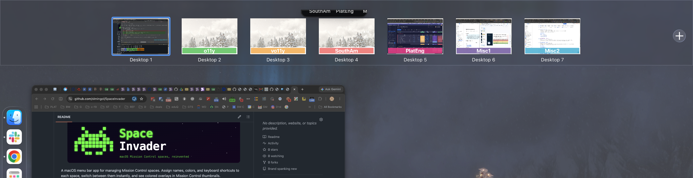
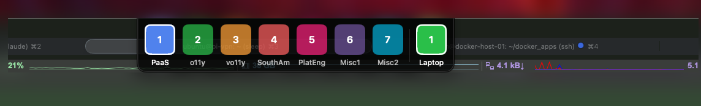
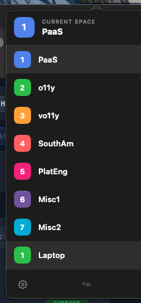

<p align="center">
  
</p>

A macOS menu bar app for managing Mission Control spaces. Assign names, colors, and keyboard shortcuts to each space, switch between them instantly, and see colored overlays in Mission Control thumbnails.

## Screenshots

<p align="center">
  <br/>
  <sub>Mission Control — colored overlays on every space thumbnail</sub>
</p>

<br/>
<br/>
<br/>
<br/>

<p align="center">
  <br/>
  <sub>HUD switcher — hover near the top of the screen to reveal; click any tile to jump directly</sub>
</p>

<br/>
<br/>
<br/>
<br/>

<table align="center"><tr>
<td align="center">
  <br/>
  <sub>Menu bar badge — active space name and color</sub>
</td>
<td align="center">
  <br/>
  <sub>Space list dropdown</sub>
</td>
</tr></table>

## Features

- **Menu bar indicator** — shows the active space name and color at a glance
- **HUD** — floating space switcher that appears near the notch; click any tile to jump directly
- **Quick Switcher** — keyboard-driven palette for jumping to any space by name or number
- **Space labels** — colored overlay visible on each non-active space
- **Per-space customization** — name, color, emoji, and dedicated keyboard shortcut (Ctrl+1–9) for each space
- **Launch at login** — runs automatically on startup

## Requirements

- macOS 15 Ventura or later
- Mission Control must have "Displays have separate Spaces" enabled (System Settings → Desktop & Dock)
- Accessibility permission (System Settings → Privacy & Security → Accessibility)

## How it works

SpaceInvader reads the current space layout from the private `CGSCopyManagedDisplaySpaces` API, which returns the live list of spaces, their CGS IDs, and which one is active. Changes are observed via `NSWorkspace.activeSpaceDidChangeNotification`.

Space switching posts synthetic Dock swipe gesture events (`kCGSEventDockControl`, type 30) via `CGEventPost` at the session event tap level. This is the same mechanism used by the Dock to handle trackpad swipes for Mission Control, and requires Accessibility permission. The private `CGSManagedDisplaySetCurrentSpace` API no longer triggers a visual space transition on macOS 26 (Tahoe) and is not used for switching.

The space label panels are borderless `NSPanel` windows pinned to their respective spaces using `CGSAddWindowsToSpaces` / `CGSRemoveWindowsFromSpaces`. Each panel sits at window level 1, is always visible on its non-active space, and syncs visibility on every space change.

On macOS 26 (Tahoe), distributed notifications from the Dock for Mission Control open/close events are no longer delivered to third-party processes. Overlays remain always-visible on non-active spaces rather than appearing exclusively during Mission Control — they are visible in MC thumbnails either way.

## Building

Open `SpaceInvader.xcodeproj` in Xcode and build the `SpaceInvader` scheme. Dependencies are resolved automatically via Swift Package Manager.

## Releases

Tagged releases automatically produce a DMG via GitHub Actions:

```bash
git tag v1.0.0
git push origin v1.0.0
```

The DMG is attached to the GitHub release once the build completes.

## Dependencies

- [KeyboardShortcuts](https://github.com/sindresorhus/KeyboardShortcuts) — global hotkey registration
- [LaunchAtLogin](https://github.com/sindresorhus/LaunchAtLogin-Modern) — login item management

## Lineage

SpaceInvader draws on two earlier projects:

- **[SpaceJump](https://www.getspacejump.com)** — inspiration for Mission Control label overlays, the CGS space-pinning approach, and the overall UX model of named/colored spaces
- **[Spaceman](https://github.com/Jaysce/Spaceman)** — informed the menu bar rendering and space observation approach
