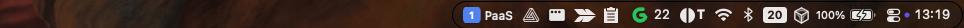
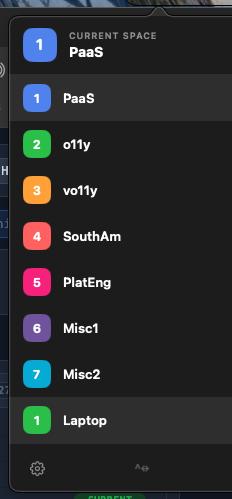
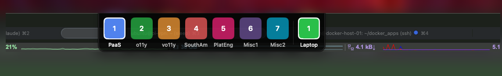
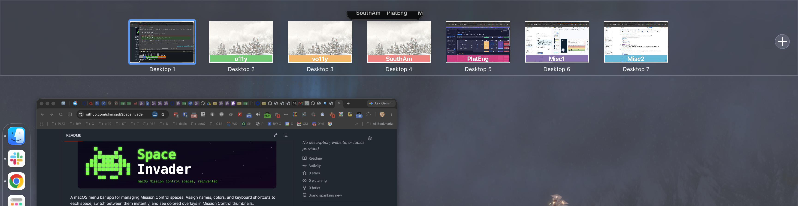
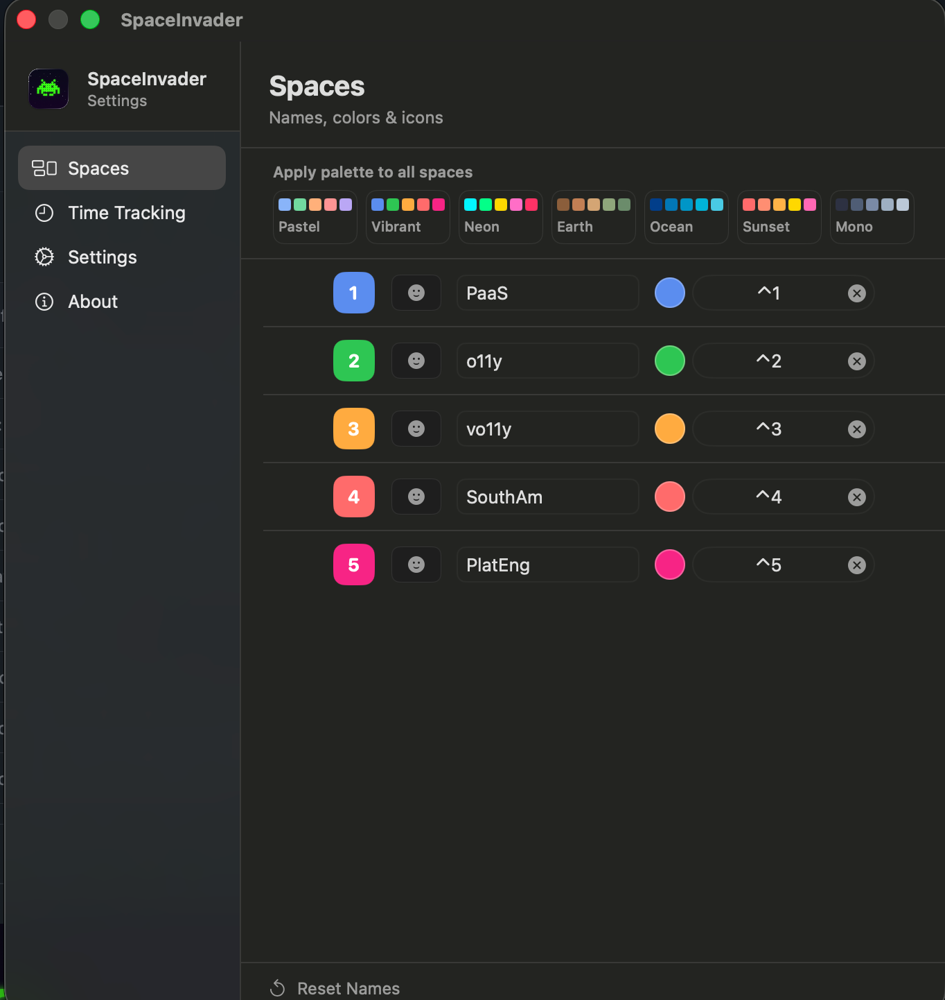
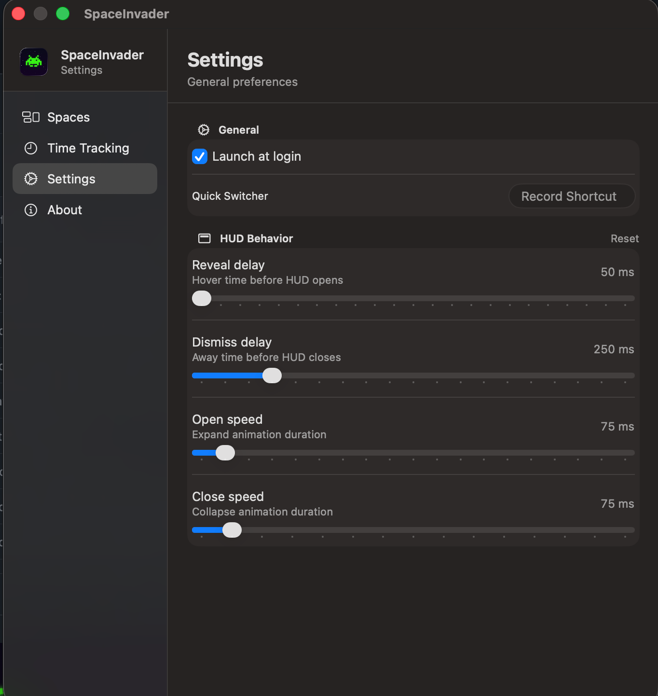

# SpaceInvader — Screenshots

## Menu bar badge

The active space name and color appear as a compact badge in the right side of the menu bar.

---

## Dropdown menu

Click the badge to open the full space list. Each space shows its assigned name, color, and index.

---

## HUD switcher

Move the cursor to the top of the screen to reveal the HUD. Each tile shows the space name and color; click any tile to switch instantly.

---

## Mission Control overlays

Space labels appear as colored overlays on each desktop thumbnail in Mission Control, making it easy to identify spaces at a glance.

---

## Spaces settings

Per-space name, color, emoji, and keyboard shortcut. Apply a palette to all spaces at once.

---

## Settings — HUD timing

Configurable reveal delay, dismiss delay, and animation durations for the HUD.

